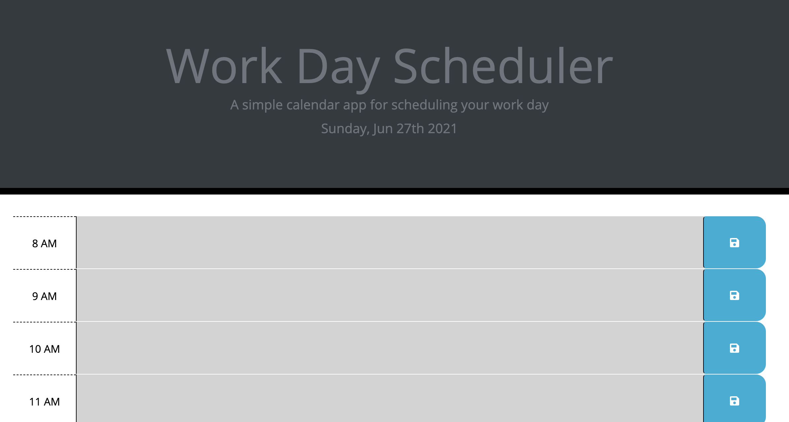
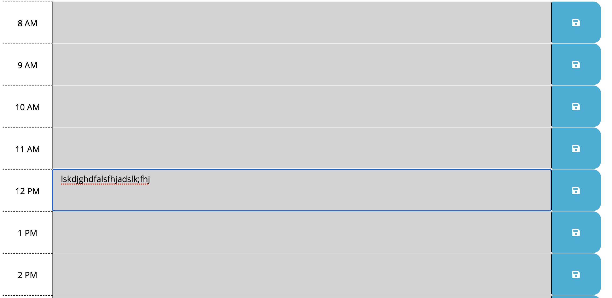

# work-day-schedular

## Description

This application is a work day schedular that is responsive to time of day. Each time slot has a color dependent upon if there is still time to complete the task for the day. When you enter the task, it is saved to local storage. You can reload the application and still see those tasks. 

## Languages

For this application, we used JS, Moment.js, CSS, and HTML.

## Link

[Live-Application](https://fausnightm.github.io/work-day-schedular/)

